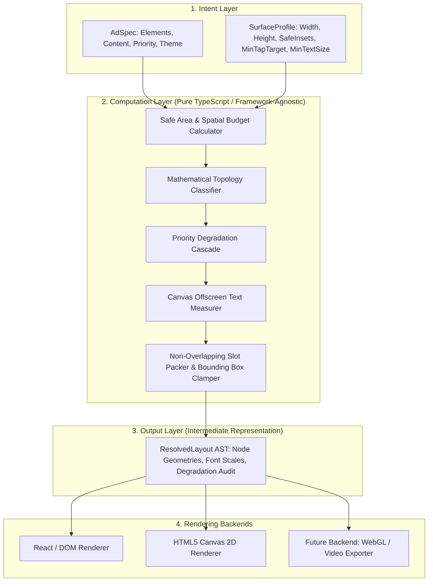

# 🏛️ Architecture & Mathematical Specification

## Flam Adaptive Layout Engine

This document provides a formal technical specification of the constraint resolution algorithm, intermediate representation (AST), and renderer decoupling architecture.

---

## 1. Architectural Principles & System Boundary

The core design goal of the engine is **strict separation between intent, computation, and rendering**:



### Key Architectural Invariants:
1. **Zero UI Framework Dependencies in Solver**: `solver.ts`, `topology.ts`, `degradation.ts`, and `text-measurer.ts` have zero dependencies on React, Vue, or DOM APIs. They execute cleanly in Node.js, Web Workers, or SSR.
2. **Zero Hardcoded Surface IDs**: The engine never branches on `surface.id === "mobile-portrait"`. All decisions are derived continuously from $(W, H, \text{safeInsets}, \text{interactionMode}, \text{viewingDistance})$.
3. **Deterministic Output**: Given identical $(Spec, Surface)$, the solver produces the exact same deterministic geometry in $< 1\text{ms}$.

---

## 2. Mathematical Formalization

### 2.1 Spatial Budgeting
Given a surface with physical dimensions $(W_s, H_s)$ and safe insets $I = (I_{top}, I_{right}, I_{bottom}, I_{left})$:
$$W_u = W_s - (I_{left} + I_{right})$$
$$H_u = H_s - (I_{top} + I_{bottom})$$
$$\text{Area}_u = W_u \times H_u$$

The continuous Aspect Ratio ($\text{AR}$) is defined as:
$$\text{AR} = \frac{W_u}{H_u}$$

### 2.2 Topology Classification Function
The macro layout topology $T$ is determined by a continuous piecewise mapping:

$$T(\text{AR}, H_u) = \begin{cases} 
\text{compact-strip} & \text{if } \text{AR} \ge 2.8 \land H_u < 160 \\
\text{banner-inline} & \text{if } \text{AR} \ge 2.8 \land H_u \ge 160 \\
\text{split-horizontal} & \text{if } 1.3 \le \text{AR} < 2.8 \\
\text{quadrant-grid} & \text{if } 0.8 \le \text{AR} < 1.3 \\
\text{split-vertical} & \text{if } \text{AR} < 0.8 
\end{cases}$$

### 2.3 Priority Degradation & Capacity Planning
Let $E = \{e_1, e_2, \dots, e_n\}$ be the set of elements in the ad spec, sorted such that:
$$P(e_1) \ge P(e_2) \ge \dots \ge P(e_n)$$
where $P(e) \in [1, 100]$ is the element's priority weight.

Each element has a minimum area footprint requirement $\Omega(e)$. The engine iteratively evaluates the retention condition:
$$\sum_{i=1}^{k} \Omega(e_i) \le \alpha \cdot \text{Area}_u \quad (\text{where } \alpha = 0.95)$$

If the condition is violated for element $e_k$:
- If $P(e_k) \ge 90$ (e.g. Headline, CTA): the element is retained, and sibling low-priority elements are evicted instead.
- If $P(e_k) < 90$: element $e_k$ is placed into the **Dropped Set** with an explicit audit reason.

### 2.4 WCAG 2.5.5 Touch Target Compliance
For any surface where $\text{interactionMode} \in \{\text{touch}, \text{kiosk\_touch}\}$:
For each interactive node $N_{cta}$:
$$\text{Width}(N_{cta}) \ge \text{minTapTarget} \quad (44\text{px} \dots 48\text{px})$$
$$\text{Height}(N_{cta}) \ge \text{minTapTarget} \quad (44\text{px} \dots 48\text{px})$$

---

## 3. Node Geometry Intermediate Representation (AST)

The output of the engine is a strongly typed AST structure:

```typescript
export interface ResolvedLayout {
  specId: string;
  surfaceId: string;
  surfaceWidth: number;
  surfaceHeight: number;
  safeBounds: LayoutBounds;
  nodes: ResolvedNode[];
  diagnostics: LayoutDiagnostics;
  theme: AdTheme;
}

export interface ResolvedNode {
  id: string;
  role: ElementRole;
  element: AdElement;
  bounds: { x: number; y: number; width: number; height: number };
  visible: boolean;
  opacity: number;
  scale: number;
  zIndex: number;
  computedFontSize?: number;
  computedLineHeight?: number;
  computedLines?: string[];
  isTruncated?: boolean;
  tapTargetBounds?: LayoutBounds;
  isTapTargetCompliant?: boolean;
  placementReason: string;
  degradationStage: 'original' | 'shrunk' | 'compact' | 'dropped';
}
```

---

## 4. Extensibility Proofs

### 4.1 Adding a 5th Unknown Surface Profile
To introduce a new surface (e.g. In-Car Ultra-Wide Dashboard $2560\times 720$), simply construct the profile object:
```typescript
const inCarDashboard = defineSurface({
  id: "in-car-dash",
  name: "Automotive Dashboard Display",
  width: 2560,
  height: 720,
  viewingDistance: "medium",
  interactionMode: "touch",
  minTapTarget: 56,
  minTextSize: 20
});

const layout = resolveLayout(myAdSpec, inCarDashboard);
```
**Result**: The solver calculates $\text{AR} = 3.55$, automatically selects `banner-inline` topology, expands text according to $\text{minTextSize} = 20\text{px}$, and guarantees $56\text{px}$ touch targets **without modifying a single line in the layout engine!**

### 4.2 Adding a New Renderer (e.g. WebGL / Canvas / SVG)
Because all layout decisions and font metrics are resolved ahead of time into absolute pixel bounds within `ResolvedLayout`, creating a new renderer only requires mapping `nodes.map(node => renderPrimitive(node.bounds))`. Zero layout calculations occur in the renderer layer.

---

## 5. Performance & Complexity Analysis

- **Time Complexity**: $\mathcal{O}(N \log N)$ where $N$ is the number of elements in the spec ($N \le 20$). Sorting $N$ elements takes $< 0.05\text{ms}$. Single-pass geometry placement takes $< 0.2\text{ms}$.
- **Space Complexity**: $\mathcal{O}(N)$ nodes in memory.
- **Observed Execution Time**: $\sim 0.1\text{ms} - 0.5\text{ms}$ on modern V8 engines, easily sustaining $60\text{fps}$ live drag re-resolution.
