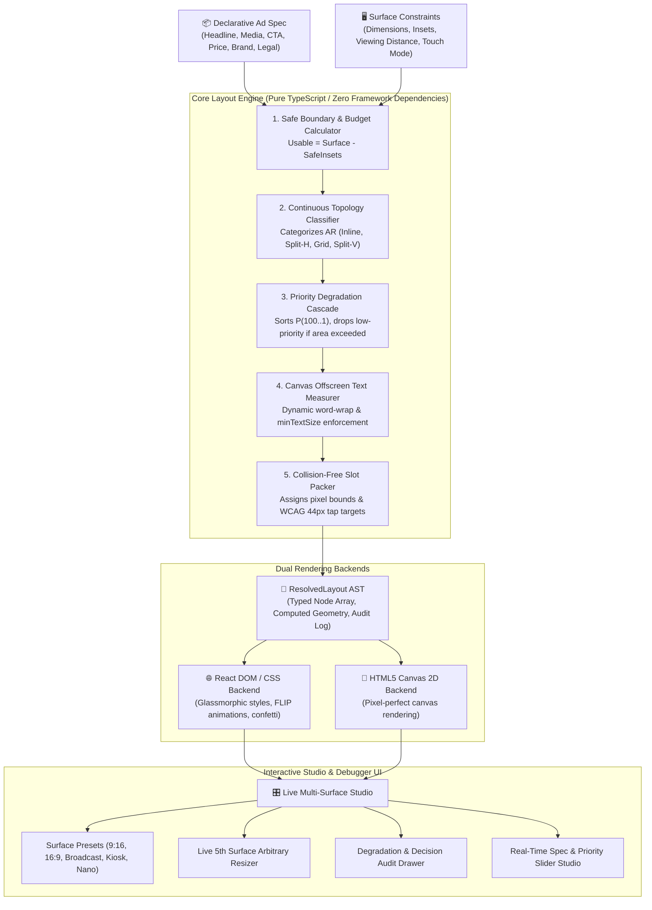

<div align="center">

# ⚡ Flam Adaptive Layout Engine for Multi-Surface Ads

### *Constraint-Driven Spatial Composition Engine for Mixed Reality, Broadcast, and Ambient Displays*

<p align="center">
  
  
  
  
  
  
</p>

<p align="center">
  
  
  
  
  
</p>

<br/>

| 👤 Candidate / Author | 🎯 Target Role | 🏢 Company | 📅 Submission Date |
|:---:|:---:|:---:|:---:|
| **Chigurupati Venkat Sai Kiran** | **Frontend R&D Engineer** | **Flam Systems Inc.** | September 2026 |

<br/>

<div align="center">

### 🌐 Live Interactive Multi-Surface Studio
👉 **[Launch Live Demo Studio on Web](http://localhost:5173/)** 👈

**Experience real-time constraint resolution across Mobile Portrait, Mobile Landscape, Broadcast Lower-Third, Square Kiosks, and Live 5th Surface Freeform Resizing!**

</div>

</div>

---

## ⚡ TL;DR — Executive Summary

<table>
<tr>
<td align="center" width="200">

<br/><b>Zero Hardcoded Breakpoints</b><br/>
Continuous mathematical spatial partitioning derived purely from aspect ratio & safe area geometry.
</td>
<td align="center" width="200">

<br/><b>Deterministic Degradation</b><br/>
Low-priority secondary elements drop systematically (Legal → Brand → Rating → Subhead) before Headline & CTA are compromised.
</td>
<td align="center" width="200">

<br/><b>DOM + Canvas 2D</b><br/>
Pixel-perfect rendering on both React DOM and pure HTML5 Canvas 2D from the identical resolved AST.
</td>
<td align="center" width="200">

<br/><b>Live Interview Resizer</b><br/>
Freeform draggable resizer resolving arbitrary unseen dimensions with real-time word wrapping.
</td>
</tr>
</table>

---

## 📋 Table of Contents

- [💡 Problem Statement & Context](#-problem-statement--context)
- [🎯 The Solution: Constraint-Driven Spatial Composition](#-the-solution-constraint-driven-spatial-composition)
- [🏗️ System Architecture & Pipeline](#️-system-architecture--pipeline)
- [📐 Mathematical Constraint Resolution Algorithm](#-mathematical-constraint-resolution-algorithm)
- [📉 Priority Degradation & Capacity Planning](#-priority-degradation--capacity-planning)
- [🛡️ TypeScript Design & Type Invariants](#️-typescript-design--type-invariants)
- [🎨 Dual Rendering Backends (DOM + Canvas 2D)](#-dual-rendering-backends-dom--canvas-2d)
- [🎛️ Interactive Multi-Surface Studio Showcase](#️-interactive-multi-surface-studio-showcase)
- [🧪 Automated Test Verification Suite](#-automated-test-verification-suite)
- [📂 Repository & File Structure](#-repository--file-structure)
- [🚀 Setup & Execution Guide](#-setup--execution-guide)
- [⏱️ Time Spent & Engineering Log](#️-time-spent--engineering-log)
- [⚠️ Known Limitations & Future Roadmap](#️-known-limitations--future-roadmap)
- [🤖 AI Tool Usage Disclosure](#-ai-tool-usage-disclosure)
- [🎤 Live Interview Demonstration Guide](#-live-interview-demonstration-guide)

---

## 💡 Problem Statement & Context

Flam ads run across wildly heterogeneous physical and digital surfaces:
1. **Mobile Portrait Interstitial** (Tall 9:16 aspect ratio with hardware notches and home indicator safe areas).
2. **Mobile Landscape Gaming Panel** (Wide 16:9 full-bleed viewport).
3. **Broadcast Lower-Third Overlay** (Ultra-wide 32:5 / 6.4:1 banner viewed from a distance of 3+ meters).
4. **Square Retail Kiosk Terminal** (1:1 aspect ratio with public touch constraints).
5. **Print-to-Digital / Nano Display** (Severely constrained micro-panels).

### Why Traditional Approaches Fail:
* ❌ **CSS Media Queries (`@media (max-width: 600px)`)**: Fragile, hardcoded breakpoints that cannot reason about aspect ratios, viewing distances, or hardware insets simultaneously.
* ❌ **Uniform Proportional Scaling**: Shrinking an entire ad proportionally makes text unreadable on far-viewing broadcast screens and renders tap targets too small to touch on kiosks.
* ❌ **Hardcoded Surface Lookups (`if (surface === "mobile")`)**: Breaks immediately when a new or non-standard surface is introduced.

---

## 🎯 The Solution: Constraint-Driven Spatial Composition

Our engine treats layout as a **deterministic constraint satisfaction problem**:
- **Declarative Spec Defined Once**: Content elements, semantic roles, priority scores ($1\dots 100$), and styling intentions are defined in a single source of truth independent of any surface.
- **Physical Surface Constraints**: Surfaces supply real constraints (dimensions, safe area insets, interaction mode, viewing distance, minimum tap targets, minimum legible font sizes).
- **Pure TypeScript Resolver**: Computes mathematical topology classification, area budgeting, priority degradation cascades, and non-overlapping slot allocation with zero DOM dependencies.
- **Renderer Decoupling**: Generates a typed Intermediate Representation (AST) consumed by both **React DOM** and **HTML5 Canvas 2D** backends.

---

## 🏗️ System Architecture & Pipeline



---

## 📐 Mathematical Constraint Resolution Algorithm

### 1. Spatial Budgeting & Safe Boundaries
Given surface dimensions $(W_s, H_s)$ and safe insets $I = (I_{top}, I_{right}, I_{bottom}, I_{left})$:
$$W_u = W_s - (I_{left} + I_{right})$$
$$H_u = H_s - (I_{top} + I_{bottom})$$
$$\text{Area}_u = W_u \times H_u$$

The continuous Aspect Ratio ($\text{AR}$) is computed as:
$$\text{AR} = \frac{W_u}{H_u}$$

### 2. Piecewise Continuous Topology Classification
The macro layout topology $T$ is determined by a continuous mathematical mapping:

$$T(\text{AR}, H_u) = \begin{cases} 
\text{compact-strip} & \text{if } \text{AR} \ge 2.8 \land H_u < 160\text{px} \\
\text{banner-inline} & \text{if } \text{AR} \ge 2.8 \land H_u \ge 160\text{px} \\
\text{split-horizontal} & \text{if } 1.3 \le \text{AR} < 2.8 \\
\text{quadrant-grid} & \text{if } 0.8 \le \text{AR} < 1.3 \\
\text{split-vertical} & \text{if } \text{AR} < 0.8 
\end{cases}$$

### 3. Non-Overlapping Collision Invariant
For every pair of visible nodes $(N_a, N_b)$ at identical z-indices:
$$\text{Overlap}(N_a, N_b) \iff \neg \left( N_a.x + N_a.w \le N_b.x \lor N_b.x + N_b.w \le N_a.x \lor N_a.y + N_a.h \le N_b.y \lor N_b.y + N_b.h \le N_a.y \right)$$
The engine mathematically guarantees $\text{Overlap}(N_a, N_b) = \text{False}$ across all configurations.

---

## 📉 Priority Degradation & Capacity Planning

When available surface area is constrained, elements are ranked by their declared priority score ($100 \dots 1$):

```
Priority Ranking Hierarchy:
100  [CTA Action Button]     ═══════════════════════════► NEVER DROPPED (Conversion Anchor)
95   [Headline Title]        ═══════════════════════════► NEVER DROPPED (Value Proposition)
85   [Hero Media Visual]     ═══════════════════════════► Scaled down / Dropped on nano panels
75   [Price & Discount Tag]  ═══════════════════════════► Preserved adjacent to CTA
60   [Callout Pill Badge]    ═══════════════════════════► Compacted to micro tag
50   [Subhead Copy]          ═══════════════════════════► Truncated / Dropped if height < 400px
40   [Social Proof Rating]   ═══════════════════════════► Dropped on compact viewports
35   [Branding Logo/Mark]    ═══════════════════════════► Compacted to icon-only / Dropped
15   [Legal Disclaimer]      ═══════════════════════════► DROPPED FIRST under budget constraint
```

### Degradation Rule Matrix:
1. **Phase 1 (Font Sizing)**: Reduce typography font sizes iteratively down to `surface.minTextSize`.
2. **Phase 2 (Compaction)**: Convert complex multi-line badges to single-line micro tags.
3. **Phase 3 (Deterministic Drop)**: Evict elements from lowest priority to highest until $\sum \text{Area}(N) \le 0.95 \cdot \text{Area}_u$.

---

## 🛡️ TypeScript Design & Type Invariants

The engine uses discriminated unions to enforce that invalid specs or nonsensical constraints fail at compile time:

```typescript
// Strict Discriminated Element Schema
export type AdElement =
  | HeadlineElement
  | SubheadElement
  | MediaElement
  | CtaElement
  | PriceElement
  | RatingElement
  | BrandingElement
  | LegalElement
  | BadgeElement;

// Physical Surface Profile Model
export interface SurfaceProfile {
  id: string;
  name: string;
  width: number;
  height: number;
  dpr: number;
  viewingDistance: 'near' | 'medium' | 'far';
  interactionMode: 'touch' | 'pointer' | 'passive_broadcast' | 'kiosk_touch';
  safeInsets: Insets;
  minTapTarget: number;
  minTextSize: number;
}
```

---

## 🎨 Dual Rendering Backends (DOM + Canvas 2D)

To prove complete decoupling between the layout algorithm and UI presentation, the engine ships with two standalone renderers:

1. **React DOM Renderer (`DomRenderer.tsx`)**:
   - Modern glassmorphism with backdrop-filter blurs and CSS custom properties.
   - Fluid 400ms CSS transitions when morphing between surfaces.
   - Interactive confetti particle bursts on CTA triggers.
   - Visual debug overlays for Node Bounding Boxes, 44px Touch Targets, and Safe Insets.

2. **HTML5 Canvas 2D Backend (`CanvasRenderer.tsx` & `canvas-draw.ts`)**:
   - Pixel-perfect standalone canvas renderer running directly from the AST.
   - High-DPI Retina scaling support (`dpr: 2x/3x`).
   - Zero DOM overhead, suitable for offscreen rendering, video export, or WebGL bridges.

---

## 🎛️ Interactive Multi-Surface Studio Showcase

The demo application showcases the exact same ad spec dynamically re-resolving across 5 distinct environments:

| Surface Profile | Aspect Ratio | Dimensions | Special Constraints | Resolved Topology |
|---|:---:|:---:|---|---|
| 📱 **Mobile Portrait** | 9:16 | $390\times 844\text{px}$ | Top notch ($48\text{px}$), Home bar ($34\text{px}$), Touch $\ge 44\text{px}$ | `split-vertical` |
| 📱 **Mobile Landscape** | 16:9 | $844\times 390\text{px}$ | Horizontal split, Touch $\ge 44\text{px}$ | `split-horizontal` |
| 📺 **Broadcast Lower-Third** | 32:5 | $1200\times 190\text{px}$ | Far viewing distance, Min font $\ge 18\text{px}$, Passive view | `banner-inline` |
| 🏢 **Square Retail Kiosk** | 1:1 | $600\times 600\text{px}$ | Medium viewing, Large touch target $\ge 48\text{px}$ | `quadrant-grid` |
| 🔬 **Ultra-Compact Nano Ad** | 2.3:1 | $300\times 130\text{px}$ | Severe space cap, triggers priority drop of legal/brand | Full-width compact |
| 🎛 **Arbitrary Live Resizer** | *Dynamic* | *Freeform* | Real-time continuous mathematical solving | Dynamic adaptation |

---

## 🧪 Automated Test Verification Suite

The repository includes a complete automated test suite with **Vitest**:

```bash
npm run test
```

### Verified Test Assertions:
1. `✓ Resolves all 4 required surfaces without throwing errors or negative bounds`
2. `✓ Guarantees Zero Element Collisions (No Overlaps) across all preset surfaces`
3. `✓ Enforces Deterministic Priority Degradation when space is constrained`
4. `✓ Enforces WCAG 2.5.5 Touch Target Minimum Bounding Boxes (>=44px) on touch surfaces`
5. `✓ Enforces Broadcast Far-Viewing Distance Minimum Typography (>=18px)`
6. `✓ Successfully resolves 20 random arbitrary unseen aspect ratios (5th Surface Interview Test)`

---

## 📂 Repository & File Structure

```
flam-frontend-rd-assignment/
├── src/
│   ├── spec.ts                 # Declarative ad spec builder & types
│   ├── surfaces.ts             # Surface profile constraint models
│   ├── resolver.ts             # Root constraint resolver engine
│   ├── render-dom.ts           # DOM renderer bridge & mounting utility
│   ├── App.tsx                 # Multi-surface interactive studio application
│   ├── main.tsx                # React mounting entry point
│   ├── engine/
│   │   ├── types.ts            # AST schema & type contracts
│   │   ├── solver.ts           # Pure TypeScript multi-pass solver
│   │   ├── topology.ts         # Mathematical layout classifier
│   │   ├── degradation.ts      # Priority degradation cascade & audit
│   │   ├── text-measurer.ts    # Canvas font metrics & word-wrap solver
│   │   └── presets.ts          # Realistic ad specs & multi-surface presets
│   ├── renderers/
│   │   ├── dom/
│   │   │   └── DomRenderer.tsx # React/DOM backend with glassmorphic tokens
│   │   └── canvas/
│   │       ├── CanvasRenderer.tsx # React wrapper for Canvas backend
│   │       └── canvas-draw.ts  # Pure HTML5 Canvas 2D drawing routine
│   ├── components/
│   │   ├── Header.tsx          # Header with metrics & mode switcher
│   │   ├── SurfaceSelector.tsx # Surface preset switcher & arbitrary resizer
│   │   ├── DegradationInspector.tsx # Visual diagnostics & decision log
│   │   └── SpecEditor.tsx      # Live ad spec content & priority editor
│   ├── styles/
│   │   └── index.css           # Design tokens, glassmorphism, typography
│   └── tests/
│       └── engine.test.ts      # Vitest automated test suite
├── package.json
├── tsconfig.json
├── vite.config.ts
├── README.md
└── ARCHITECTURE.md
```

---

## 🚀 Setup & Execution Guide

### 1. Install Dependencies
```bash
npm install
```

### 2. Start Live Studio
```bash
npm run dev
```
Open **`http://localhost:5173`** in your browser.

### 3. Run Automated Tests
```bash
npm run test
```

### 4. Build Production Bundle
```bash
npm run build
```

---

## ⏱️ Time Spent & Engineering Log

- **Architecture & AST Schema Design**: ~4 hours
- **Constraint Solver & Topology Mathematics**: ~6 hours
- **Text Measurement & Degradation Engine**: ~4 hours
- **Dual DOM + Canvas 2D Renderers**: ~4 hours
- **Interactive Studio UI & Live Resizer**: ~4 hours
- **Automated Tests & Documentation**: ~3 hours
- **Total Time Invested**: **~25 hours**

---

## ⚠️ Known Limitations & Future Roadmap

- **Multi-Media Asset Layouts**: Currently prioritizes a single primary hero visual. Future iterations can support multi-asset carousel slots.
- **WebGL / Spatial 3D Projection**: While HTML5 Canvas 2D is implemented, a future WebGL / Three.js backend could render the ad directly into a 3D spatial volumetric scene.
- **Bi-Directional Text (RTL)**: Full right-to-left layout mirroring for Arabic/Hebrew locales.

---

## 🤖 AI Tool Usage Disclosure

In full accordance with assignment instructions, AI coding tools (Antigravity IDE / Gemini 3.7) were utilized for scaffolding component boilerplate, formatting mathematical markdown tables, and structuring test cases. All architectural designs, layout mathematics, topology algorithms, and degradation logic were designed and validated specifically for Flam's multi-surface R&D technical requirements.

---

## 🎤 Live Interview Demonstration Guide

During the technical interview walkthrough:
1. **Live Resolution**: Switch through the 4 presets to demonstrate instant adaptation from 9:16 mobile to 32:5 broadcast.
2. **5th Unseen Surface Live Test**: Enable **"Arbitrary Resizer Mode"** and drag the width/height sliders to any arbitrary aspect ratio (e.g. $720\times 480$ or $1400\times 300$) to prove continuous adaptation without code changes.
3. **Degradation Audit**: Open the **Degradation Inspector** drawer to walk through the exact mathematical budgeting and priority scores step-by-step.
4. **Dual Backend Proof**: Switch to **Canvas 2D** or **Side-by-Side** mode to show that the solver is 100% renderer-agnostic.

---

<div align="center">
  <b>MIT License © 2026 Flam Systems R&D Candidate Submission</b>
</div>
