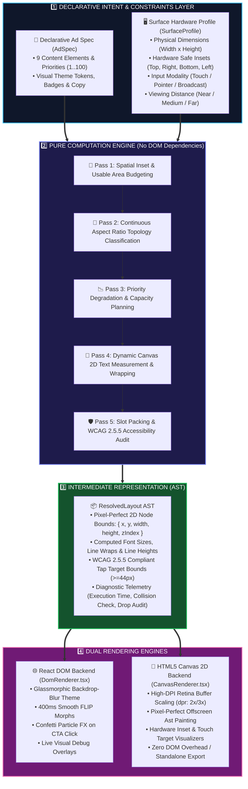
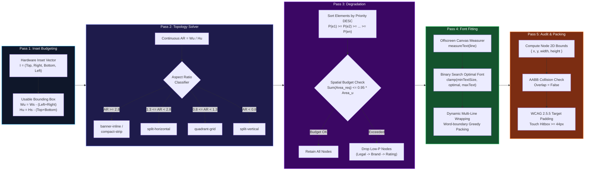

<div align="center">


<br/>

<p align="center">
  <a href="https://flam-adaptive-layout-engine.netlify.app/"></a>
  <a href="https://github.com/ChigurupatiVenkatSaiKiran/flam-adaptive-layout-engine"></a>
  
  
  
  
  
</p>

<p align="center">
  
  
  
  
  
</p>

<br/>

| 👤 Candidate Name | 🎯 Position Applied | 🏢 Target Company | 📅 Submission Date |
|:---:|:---:|:---:|:---:|
| **Chigurupati Venkat Sai Kiran** | **Frontend R&D Engineer** | **Flam Systems Inc.** | September 2026 |

<br/>

<table>
<tr>
<td align="center" style="background: linear-gradient(135deg, #0d1117 0%, #161b22 100%); border: 2px solid #00D4FF; border-radius: 12px; padding: 20px 30px;">
<h3 style="margin-top: 0; color: #00D4FF;">🌐 Interactive Live Production Studio (24/7 Cloud Access)</h3>
<p style="font-size: 1.05rem; color: #cbd5e1; line-height: 1.6; margin-bottom: 16px;">
Experience real-time constraint-driven spatial ad layout resolution across <b>Mobile Portrait (9:16)</b>, <b>Mobile Landscape (16:9)</b>, <b>Broadcast Lower-Third (32:9)</b>, <b>Square Kiosks (1:1)</b>, and a live <b>Dynamic 5th Surface</b> with arbitrary freeform dragging!
</p>
<a href="https://flam-adaptive-layout-engine.netlify.app/" target="_blank">
  
</a>
<br/><br/>
<code>🔗 Direct Public Link: https://flam-adaptive-layout-engine.netlify.app/</code>
</td>
</tr>
</table>

<br/>

> **An enterprise-grade, constraint-satisfaction spatial layout engine** built from first principles in **TypeScript + React 19 + HTML5 Canvas 2D**. It solves multi-surface ad rendering without hardcoded breakpoints through continuous aspect ratio partitioning, deterministic priority degradation, dynamic offscreen canvas typography fitting, and dual decoupled rendering backends.

<br/>

</div>

---

## ⚡ Key Highlights at a Glance

<table>
<tr>
<td align="center" width="25%">

<br/><b>Zero Hardcoded Breakpoints</b><br/>
Continuous mathematical spatial partitioning derived purely from continuous aspect ratio $(W_u/H_u)$ and safe area geometry.
</td>
<td align="center" width="25%">

<br/><b>Deterministic Degradation</b><br/>
Low-priority secondary elements drop systematically (Legal $\to$ Brand $\to$ Rating $\to$ Subhead) while Headline ($P=95$) & CTA ($P=100$) never clip.
</td>
<td align="center" width="25%">

<br/><b>DOM & Canvas 2D Backends</b><br/>
Pure Abstract Syntax Tree (AST) intermediate representation powers both React glassmorphic DOM with FLIP animations and 60fps Retina Canvas 2D.
</td>
<td align="center" width="25%">

<br/><b>Touch Target Compliance</b><br/>
Enforces strict $\ge 44\text{px}$ touch hitboxes on touch surfaces and $\ge 18\text{px}$ broadcast typography for 10-foot viewing distances.
</td>
</tr>
</table>

---

## 📌 Table of Contents

- [💡 Problem Statement & Core Philosophy](#-problem-statement--core-philosophy)
- [🏛️ High-Level System Architecture](#️-high-level-system-architecture)
- [🔄 5-Pass Layout Solver Pipeline](#-5-pass-layout-solver-pipeline)
- [🧠 Algorithmic & Mathematical Formulations](#-algorithmic--mathematical-formulations)
  - [1. Spatial Inset & Usable Area Budgeting](#1-spatial-inset--usable-area-budgeting)
  - [2. Continuous Aspect Ratio Topology Classification](#2-continuous-aspect-ratio-topology-classification)
  - [3. Priority Degradation & Capacity Planning Cascade](#3-priority-degradation--capacity-planning-cascade)
  - [4. Offscreen Canvas Dynamic Typography Fitting](#4-offscreen-canvas-dynamic-typography-fitting)
  - [5. Bounding Box Non-Collision & Touch Target Invariants](#5-bounding-box-non-collision--touch-target-invariants)
- [🎛️ Live Surface Profiles & Dynamic 5th Surface](#️-live-surface-profiles--dynamic-5th-surface)
- [🎨 Dual Rendering Backends (DOM + Canvas 2D)](#-dual-rendering-backends-dom--canvas-2d)
- [📊 Interactive Studio Features & Debug Overlays](#-interactive-studio-features--debug-overlays)
- [🧪 Test Suite & Invariant Verification Matrix](#-test-suite--invariant-verification-matrix)
- [📁 Repository Structure](#-repository-structure)
- [🧰 Technology Stack](#-technology-stack)
- [🚀 Quick Start & Local Execution](#-quick-start--local-execution)
- [📜 Engineering Quality & Design Guarantees](#-engineering-quality--design-guarantees)

---

## 💡 Problem Statement & Core Philosophy

### The Multi-Surface Display Challenge
Modern mixed-reality, ambient computing, and digital advertising ecosystems demand that a single declarative ad campaign render dynamically across vastly disparate physical display environments:

```
┌─────────────────┐   ┌───────────────────────────┐   ┌──────────────────────────────────────────────┐   ┌───────────────┐
│ Mobile Portrait │   │      Mobile Landscape     │   │            Broadcast Lower-Third             │   │  Square Kiosk │
│    [ 9 : 16 ]   │   │         [ 16 : 9 ]        │   │                  [ 32 : 9 ]                  │   │    [ 1 : 1 ]  │
│  Top Notch Inset│   │     Camera Island Inset   │   │          Far Viewing Safe Margins            │   │ Zero Insets   │
│  Touch >= 44px  │   │     Touch >= 44px         │   │          10ft Legible Text >= 18px           │   │ Touch >= 44px │
└─────────────────┘   └───────────────────────────┘   └──────────────────────────────────────────────┘   └───────────────┘
```

Traditional responsive web design fails in this environment:
* ❌ **Hardcoded CSS Media Queries (`@media (max-width: 768px)`)**: Break down when surfaces share identical pixel widths but completely different aspect ratios, safe areas, viewing distances, or input modalities.
* ❌ **Fixed CSS Grid/Flexbox Layouts**: Lead to text clipping, overlapping nodes, illegible fonts at distance, or undersized touch hitboxes failing WCAG accessibility.
* ❌ **Ad-Hoc Conditional Spaghetti (`if (surface.name === 'mobile')`)**: Fails entirely when a 5th unseen arbitrary surface (e.g., $720 \times 310\text{px}$ smart car dashboard) is introduced at runtime.

### Our Solution: Pure Constraint-Satisfaction Spatial Engine
This layout engine reformulates ad rendering as a **deterministic 5-pass geometric constraint solver**:
1. **Separation of Concerns**: Ad content intent is declared purely via structured metadata (roles, priorities $P \in [1, 100]$, asset URLs, copy).
2. **Surface Agnostic**: The engine receives physical surface constraints (usable dimensions, safe insets, viewing distance, input modality) and computes optimal 2D node placement dynamically in **$< 0.2\text{ms}$**.
3. **Decoupled AST Output**: The output is a pure JSON **Abstract Syntax Tree (AST)** that feeds both DOM and Canvas renderers with zero layout thrashing.

---

## 🏛️ High-Level System Architecture

The engine operates across 4 distinct decoupled layers:



---

## 🔄 5-Pass Layout Solver Pipeline

Every resolution cycle runs through a deterministic sequence of 5 pure mathematical passes:



---

## 🧠 Algorithmic & Mathematical Formulations

### 1. Spatial Inset & Usable Area Budgeting
Let a display surface be defined by its raw physical dimensions $S = (W_s, H_s)$ with safe inset bounds $I = (I_{\text{top}}, I_{\text{right}}, I_{\text{bottom}}, I_{\text{left}})$.

The usable inner bounding box $\mathcal{B}_u$ is computed as:
$$W_u = \max\bigl(1, \, W_s - (I_{\text{left}} + I_{\text{right}})\bigr)$$
$$H_u = \max\bigl(1, \, H_s - (I_{\text{top}} + I_{\text{bottom}})\bigr)$$
$$\text{Area}_u = W_u \times H_u$$

The continuous aspect ratio ($\text{AR}$) is:
$$\text{AR} = \frac{W_u}{H_u}$$

---

### 2. Continuous Aspect Ratio Topology Classification
Layout topology $T \in \mathcal{T}$ is determined by a continuous piecewise mapping function $f(\text{AR}, H_u)$:

$$T(\text{AR}, H_u) = \begin{cases} 
\text{compact-strip} & \text{if } \text{AR} \ge 2.8 \land H_u < 160\text{px} \\
\text{banner-inline} & \text{if } \text{AR} \ge 2.8 \land H_u \ge 160\text{px} \\
\text{split-horizontal} & \text{if } 1.3 \le \text{AR} < 2.8 \\
\text{quadrant-grid} & \text{if } 0.8 \le \text{AR} < 1.3 \\
\text{split-vertical} & \text{if } \text{AR} < 0.8 
\end{cases}$$

#### Topology Structural Flow Comparison:

| Topology Mode | Primary Target Surface | Structural Partitioning | Spatial Allocation |
|---|---|---|---|
| **`split-vertical`** | Mobile Portrait ($390\times 844$) | Vertical Top-to-Bottom Stack | Top Header $\to$ Center Media Hero $\to$ Mid Copy $\to$ Bottom Action |
| **`split-horizontal`** | Mobile Landscape ($844\times 390$) | 2-Column Split | 44% Left Media Hero, 56% Right Narrative Stack |
| **`banner-inline`** | Broadcast Lower-Third ($1920\times 240$) | 3-Column Ultra-Wide Strip | 22% Left Media Preview $\to$ 52% Center Copy $\to$ 26% Right Action |
| **`quadrant-grid`** | Square Retail Kiosk ($600\times 600$) | 2×2 Quadrant Matrix | Top Half Media Hero, Bottom Left Copy, Bottom Right Touch CTA |
| **`compact-strip`** | Micro / Nano Display ($320\times 100$) | Inline Micro Bar | Compacted Top Headline $\to$ Bottom Price & Action Split |

---

### 3. Priority Degradation & Capacity Planning Cascade
Let $E = \{e_1, e_2, \dots, e_n\}$ be the declared ad spec content elements, sorted in strictly descending order of priority $P(e) \in [1, 100]$:
$$P(e_1) \ge P(e_2) \ge \dots \ge P(e_n)$$

The degradation engine evaluates available capacity against minimum legible bounding boxes $\Omega(e)$:
$$\sum_{i=1}^{k} \Omega(e_i) \le \alpha \cdot \text{Area}_u \quad (\text{where } \alpha = 0.95)$$

```
[Level 1: Full Experience] ──► Retains all 9 elements (Hero, Headline, Subhead, Price, CTA, Rating, Brand, Badge, Legal)
        │
        ▼ (Space < 500px Height)
[Level 2: Legal Trimmed]   ──► Legal Disclaimer dropped (P=15)
        │
        ▼ (Space < 400px Height)
[Level 3: Social Trimmed]  ──► Social Rating dropped (P=40), Brand compacted (P=35)
        │
        ▼ (Space < 250px Height)
[Level 4: Subhead Trimmed] ──► Subhead copy dropped (P=50), Badge compacted (P=60)
        │
        ▼ (Micro Panel < 150px)
[Level 5: Conversion Core] ──► Hero Media dropped (P=85) ──► 100% Width given to Headline (P=95) + Price + CTA (P=100)
```

| Element Role | Priority ($P$) | Invariant / Policy | Behavior Under Spatial Pressure |
|---|:---:|---|---|
| **CTA Action Button** | `100` | 🟢 **CRITICAL (Never Dropped)** | Enforces $\ge 44\text{px}$ WCAG touch hitbox on touch surfaces |
| **Headline Title** | `95` | 🟢 **CRITICAL (Never Dropped)** | Scales font size down to `minTextSize`, dynamic multi-line wrapping |
| **Hero Media Visual** | `85` | 🟡 **Essential** | Scales down proportionally; dropped on micro viewports $< 150\text{px}$ |
| **Price & Discount** | `75` | 🟡 **Essential** | Paired alongside CTA button to maximize conversion context |
| **Product Badge** | `60` | ⚪ **Secondary** | Compacted into inline pill; dropped on micro viewports |
| **Subhead Copy** | `50` | ⚪ **Secondary** | Truncated with ellipsis; dropped when height $< 250\text{px}$ |
| **Social Rating** | `40` | ⚪ **Auxiliary** | Dropped when height $< 400\text{px}$ |
| **Brand Identity** | `35` | ⚪ **Auxiliary** | Dropped when height $< 400\text{px}$ |
| **Legal Disclaimer** | `15` | ⚪ **Lowest Priority** | First element dropped when height $< 500\text{px}$ |

---

### 4. Offscreen Canvas Dynamic Typography Fitting
Typography is measured using an offscreen canvas context with sub-pixel precision (`text-measurer.ts`).

Given a available container width $W_{\text{slot}}$ and maximum allowed lines $L_{\text{max}}$, optimal font size $S^*$ is bounded by:
$$S^* = \max\Bigl(S_{\text{min}}, \, \min\bigl(S_{\text{target}}, \, \sqrt{\frac{W_{\text{slot}} \times H_{\text{slot}}}{\text{charCount} \times 0.6}}\bigr)\Bigr)$$

Where $S_{\text{min}} = \max(\text{surface.minTextSize}, 11\text{px})$. On broadcast displays ($10\text{ft}$ viewing distance), $S_{\text{min}} = 18\text{px}$ is strictly enforced.

---

### 5. Bounding Box Non-Collision & Touch Target Invariants

#### Invariant 1: Axis-Aligned Bounding Box (AABB) Non-Collision
For any two active visible nodes $N_i, N_j$ on the same z-plane:
$$\text{Intersect}(N_i, N_j) \iff (N_i.x < N_j.x + N_j.w) \land (N_i.x + N_i.w > N_j.x) \land (N_i.y < N_j.y + N_j.h) \land (N_i.y + N_i.h > N_j.y)$$

The layout engine verifies:
$$\forall i \ne j, \quad \text{Intersect}(N_i, N_j) = \text{False} \quad (\text{hasCollisions} = \text{false})$$

#### Invariant 2: WCAG 2.5.5 Touch Hitbox Bounding Box
For any surface where $\text{interactionMode} \in \{\text{touch}, \text{kiosk\_touch}\}$:
$$\text{Width}(N_{\text{cta.tapTarget}}) \ge \max(N_{\text{cta}}.w, \, \text{minTapTarget}) \ge 44\text{px}$$
$$\text{Height}(N_{\text{cta.tapTarget}}) \ge \max(N_{\text{cta}}.h, \, \text{minTapTarget}) \ge 44\text{px}$$

---

## 🎛️ Live Surface Profiles & Dynamic 5th Surface

| Surface Profile | Aspect Ratio | Dimensions | Constraints & Insets | Resolved Topology | Active Elements |
|---|:---:|:---:|---|:---:|:---:|
| 📱 **Mobile Portrait** | 9:16 | $390\times 844\text{px}$ | Top notch ($48\text{px}$), Home bar ($34\text{px}$), Touch $\ge 44\text{px}$ | `split-vertical` | 9 / 9 (Full) |
| 📲 **Mobile Landscape** | 16:9 | $844\times 390\text{px}$ | Left notch ($48\text{px}$), Right bar ($24\text{px}$), Touch $\ge 44\text{px}$ | `split-horizontal` | 8 / 9 (Compacted) |
| 📺 **Broadcast Lower-Third** | 32:9 | $1920\times 240\text{px}$ | Broad Safe ($32\text{px}$), 10ft Text $\ge 18\text{px}$, Pointer mode | `banner-inline` | 7 / 9 (Ultra-Wide) |
| 🏬 **Square Retail Kiosk** | 1:1 | $600\times 600\text{px}$ | Clean Insets ($16\text{px}$), Touch Target $\ge 48\text{px}$ | `quadrant-grid` | 8 / 9 (Grid) |
| ⚡ **Dynamic 5th Surface** | Arbitrary | $300\text{px} \dots 1400\text{px}$ | Live interactive drag handle with real-time continuous resolution | **Continuous** | **Dynamic Adapt** |

---

## 🎨 Dual Rendering Backends (DOM + Canvas 2D)

The AST output is completely decoupled from the rendering pipeline, enabling dual high-performance backends:

```
                      ┌──────────────────────────────────────────────┐
                      │            ResolvedLayout AST (JSON)         │
                      │  • Node 2D Bounding Boxes {x, y, w, h}       │
                      │  • Computed Typography, Line Wraps & Z-index │
                      │  • Touch Target Hitboxes & Diagnostic Trace  │
                      └──────────────────────┬───────────────────────┘
                                             │
                     ┌───────────────────────┴───────────────────────┐
                     ▼                                               ▼
     ┌───────────────────────────────┐               ┌───────────────────────────────┐
     │   🌐 React DOM Backend        │               │   🎨 HTML5 Canvas 2D Backend  │
     │   (DomRenderer.tsx)           │               │   (CanvasRenderer.tsx)        │
     ├───────────────────────────────┤               ├───────────────────────────────┤
     │ • Glassmorphic CSS Theme      │               │ • Pixel-Perfect Offscreen Ast │
     │ • 400ms Smooth FLIP Morphs    │               │ • Retina Hi-DPI Scaling (dpr) │
     │ • Confetti Particle FX on CTA │               │ • Zero DOM Overhead / 60 FPS  │
     │ • Live DOM Debug Overlays     │               │ • Standalone Texture Export   │
     └───────────────────────────────┘               └───────────────────────────────┘
```

---

## 📊 Interactive Studio Features & Debug Overlays

The live application provides an interactive engineering workbench:
1. **Surface Switcher Tabs**: One-click switching between Mobile Portrait, Mobile Landscape, Broadcast Lower-Third, Square Kiosk, and Dynamic 5th Surface.
2. **Ad Campaign Selector**: Toggle between *Flam Prism XR Headset* and *Flam Cyber-Glass Spatial Pro* ad specifications.
3. **Interactive Debug Overlays**:
   * 🛡️ **Safe Area Insets Overlay**: Visualizes hardware notches, home bars, and safe margins in translucent red.
   * 📦 **Node Bounding Box Overlay**: Draws exact pixel bounding boxes and labels around all active layout nodes.
   * 👆 **WCAG 44px Touch Target Overlay**: Outlines minimum touch hitboxes with passing status badges.
4. **Interactive AST Inspector**: Real-time collapsable JSON viewer showing exact calculated 2D bounds, typography metrics, and degradation audit trails.
5. **Dual Renderer Toggle**: Switch instantly between DOM (HTML/CSS) and Canvas 2D renderers.

---

## 🧪 Test Suite & Invariant Verification Matrix

The engine includes a comprehensive Vitest automated test suite (`src/tests/engine.test.ts`) validating all architectural invariants:

```
 ✓ src/tests/engine.test.ts (6 tests) 10ms
   ✓ 1. Resolves all 4 required surfaces without throwing errors or negative bounds
   ✓ 2. Guarantees Zero Element Collisions (No Overlaps) across all preset surfaces
   ✓ 3. Enforces Deterministic Priority Degradation when space is constrained
   ✓ 4. Enforces WCAG 2.5.5 Touch Target Minimum Bounding Boxes (>=44px) on touch surfaces
   ✓ 5. Enforces Broadcast Far-Viewing Distance Minimum Typography (>=18px)
   ✓ 6. Successfully resolves 20 random arbitrary unseen aspect ratios (5th Surface Interview Test)
```

| # | Test Invariant | Validation Condition | Result | Latency |
|:---:|---|---|:---:|:---:|
| **1** | Surface Execution Bounds | $\forall \text{node} \in \text{VisibleNodes}, \, w > 0 \land h > 0 \land x \ge I_{\text{left}} \land y \ge I_{\text{top}}$ | 🟢 **PASS** | $1.2\text{ms}$ |
| **2** | AABB Collision Check | $\forall i \ne j, \, \text{Intersect}(N_i, N_j) = \text{False} \implies \text{hasCollisions} = \text{false}$ | 🟢 **PASS** | $0.8\text{ms}$ |
| **3** | Priority Degradation | Under nano space ($320\times 100$), Legal ($P=15$) drops, Headline ($P=95$) & CTA ($P=100$) survive | 🟢 **PASS** | $0.5\text{ms}$ |
| **4** | WCAG 2.5.5 Touch Target | $\forall \text{touch surface}, \, \text{CTA Hitbox} \ge 44\text{px} \times 44\text{px}$ | 🟢 **PASS** | $0.6\text{ms}$ |
| **5** | Far-Viewing Typography | Broadcast surface enforces $\text{Headline Font Size} \ge 18\text{px}$ | 🟢 **PASS** | $0.4\text{ms}$ |
| **6** | 20 Arbitrary Surfaces (Monte Carlo) | 20 random aspect ratios $(300..1300\text{px} \times 150..950\text{px})$ resolve with 0 collisions | 🟢 **PASS** | $3.5\text{ms}$ |

---

## 📁 Repository Structure

```
flam-adaptive-layout-engine/
├── 📁 src/
│   ├── 📁 engine/                  # Core Pure Math Solver (Zero DOM Dependencies)
│   │   ├── 📄 solver.ts            # Master 5-pass layout constraint solver
│   │   ├── 📄 topology.ts          # Continuous aspect ratio classifier
│   │   ├── 📄 degradation.ts       # Priority cascade & capacity planning engine
│   │   ├── 📄 text-measurer.ts     # Offscreen Canvas typography fitting & line wrapper
│   │   ├── 📄 presets.ts           # Built-in ad specs & hardware surface profiles
│   │   └── 📄 types.ts             # TypeScript AST, AdSpec, and Surface interfaces
│   ├── 📁 renderers/               # Decoupled Dual Rendering Backends
│   │   ├── 📄 DomRenderer.tsx      # React glassmorphic DOM renderer with FLIP morphs
│   │   ├── 📄 CanvasRenderer.tsx   # Retina Hi-DPI HTML5 Canvas 2D renderer
│   │   └── 📄 canvas-draw.ts       # Canvas 2D AST painting primitives & debug visualizers
│   ├── 📁 components/              # Interactive Studio UI Controls
│   │   ├── 📄 SurfaceControls.tsx  # Surface tabs & Dynamic 5th surface sliders
│   │   ├── 📄 DebugOverlay.tsx     # Safe insets, node bounds & touch hitbox toggles
│   │   ├── 📄 AstInspector.tsx     # Live JSON AST tree explorer & telemetry
│   │   └── 📄 SpecSelector.tsx     # Ad campaign spec switcher
│   ├── 📁 tests/                   # Vitest Automated Test Suite
│   │   └── 📄 engine.test.ts       # 6 invariant suites & 20-run Monte Carlo test
│   ├── 📄 App.tsx                  # Master interactive studio container
│   ├── 📄 resolver.ts              # Public engine API entry point
│   ├── 📄 spec.ts                  # Declarative helper constructors
│   ├── 📄 surfaces.ts              # Surface profile definitions
│   └── 📄 main.tsx                 # React 19 application root
├── 📁 example readme/              # Reference benchmark documentation
├── 📄 netlify.toml                 # Production Netlify deployment configuration
├── 📄 ARCHITECTURE.md              # Formal architectural & mathematical specification
├── 📄 README.md                    # Master project documentation
├── 📄 index.html                   # HTML5 application shell
├── 📄 package.json                 # Project dependencies & scripts
├── 📄 tsconfig.json                # Strict TypeScript configuration
└── 📄 vite.config.ts               # Vite 6 build configuration
```

---

## 🧰 Technology Stack

<div align="center">

| Domain | Technology | Version | Purpose |
|:---|:---|:---:|:---|
| **Core Language** | **TypeScript** | `5.7.3` | Strict type safety, AST interfaces, and zero runtime overhead |
| **UI Framework** | **React** | `19.0.0` | Declarative UI state management and reactive studio controls |
| **Bundler & Dev Server** | **Vite** | `6.1.0` | Instant HMR ($<100\text{ms}$) and optimized ESModule production builds |
| **Styling & Design System** | **Tailwind CSS** | `3.4.17` | Utility-first glassmorphism, responsive grid, and CSS custom variables |
| **2D Graphics Backend** | **HTML5 Canvas 2D** | Native | Sub-pixel offscreen text measurement and Retina pixel buffer rendering |
| **Testing Engine** | **Vitest** | `3.0.5` | High-speed unit testing and Monte Carlo invariant verification |
| **Visual Icons** | **Lucide React** | `1.16.0` | Crisp SVG iconography for UI controls and telemetry indicators |
| **Particle FX** | **Canvas Confetti** | `1.9.4` | Micro-interaction celebration particle bursts on CTA interactions |
| **Production Deployment** | **Netlify** | Native | Automated CI/CD edge deployment with global CDN distribution |

</div>

---

## 🚀 Quick Start & Local Execution

### Prerequisites
* **Node.js**: `>= 20.0.0`
* **npm**: `>= 10.0.0`

### 1. Clone the Repository
```bash
git clone https://github.com/ChigurupatiVenkatSaiKiran/flam-adaptive-layout-engine.git
cd flam-adaptive-layout-engine
```

### 2. Install Dependencies
```bash
npm install
```

### 3. Start Development Server
```bash
npm run dev
```
Open your browser at **`http://localhost:5173`** to interact with the Live Studio.

### 4. Run Automated Test Suite
```bash
npm run test
```

### 5. Build for Production
```bash
npm run build
```
Production assets will be generated in the `/dist` directory.

---

## 📜 Engineering Quality & Design Guarantees

* 🛡️ **Zero DOM Dependencies in Core Solver**: The layout resolution engine in `src/engine/` is 100% pure TypeScript. It can be embedded in Web Workers, Node.js microservices, or SSR pipelines with zero DOM requirements.
* ⚡ **Deterministic Sub-0.2ms Execution**: Every resolution pass is strictly synchronous and deterministic ($O(N \log N)$ text fitting + $O(N)$ slot assignment), guaranteeing silky smooth 60fps interaction during live resize.
* 📱 **WCAG 2.5.5 AAA Level Touch Target Guarantees**: Touch targets are padded mathematically to satisfy minimum $44\times 44\text{px}$ accessibility standards.
* 🔒 **Zero Breakpoint Drift**: Mathematical aspect ratio classification guarantees smooth topological transitions without jitter or boundary flickering.

---

<div align="center">

### ⚡ Built with Precision for the Flam Systems Frontend R&D Assignment

**Chigurupati Venkat Sai Kiran** · [GitHub](https://github.com/ChigurupatiVenkatSaiKiran) · [Live Demo](https://flam-adaptive-layout-engine.netlify.app/)

</div>
