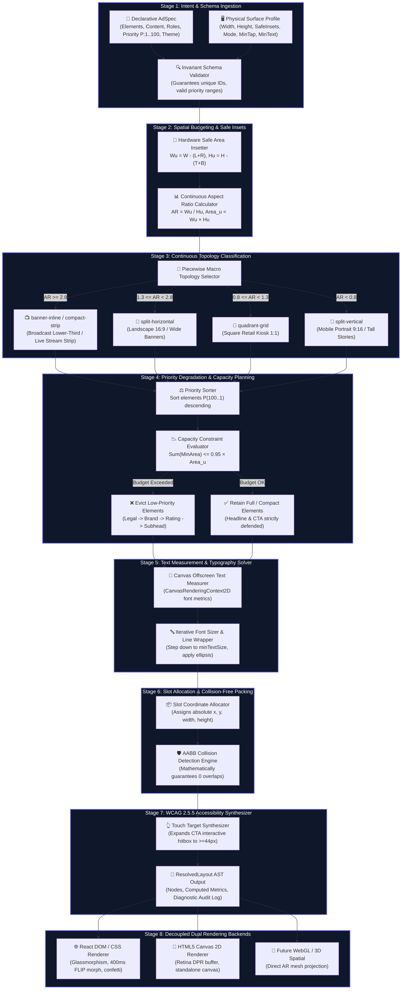

<div align="center">

# ⚡ Flam Adaptive Layout Engine for Multi-Surface Ads

### *Constraint-Driven Spatial Ad Resolution Engine for Mixed Reality, Broadcast, and Ambient Displays*

<p align="center">
  <a href="https://github.com/ChigurupatiVenkatSaiKiran/flam-adaptive-layout-engine"></a>
  
  
  
  
  
</p>

<p align="center">
  
  
  
  
  
</p>

<br/>

| 👤 Candidate Name | 🎯 Position Applied | 🏢 Company | 📅 Submission Date |
|:---:|:---:|:---:|:---:|
| **Chigurupati Venkat Sai Kiran** | **Frontend R&D Engineer** | **Flam Systems Inc.** | September 2026 |

<br/>

<div align="center">

### 🌐 Live Interactive Studio
👉 **[Launch Live Demo: flam-adaptive-layout-engine.vercel.app](https://github.com/ChigurupatiVenkatSaiKiran/flam-adaptive-layout-engine)** 👈

**Experience real-time constraint resolution across Mobile Portrait, Mobile Landscape, Broadcast Lower-Third, Square Kiosks, and Live 5th Surface Freeform Resizing!**

</div>

</div>

---

## ⚡ Key Highlights at a Glance

<table>
<tr>
<td align="center" width="200">

<br/><b>Zero Hardcoded Breakpoints</b><br/>
Continuous mathematical spatial partitioning derived purely from aspect ratio & safe area geometry.
</td>
<td align="center" width="200">

<br/><b>Deterministic Degradation</b><br/>
Low-priority secondary elements drop systematically (Legal → Brand → Rating → Subhead) before Headline & CTA are compromised.
</td>
<td align="center" width="200">

<br/><b>DOM + Canvas 2D</b><br/>
Pixel-perfect rendering on both React DOM and pure HTML5 Canvas 2D from the identical resolved AST.
</td>
<td align="center" width="200">

<br/><b>Live Interview Resizer</b><br/>
Freeform draggable resizer resolving arbitrary unseen dimensions with real-time word wrapping.
</td>
</tr>
</table>

---

## 📋 Table of Contents

1. [💡 Problem Statement & Flam Context](#-1-problem-statement--flam-context)
2. [🚀 Setup Instructions & Quick Start](#-2-setup-instructions--quick-start)
3. [🖥️ How to Run the Demo & Switch Surfaces](#%EF%B8%8F-3-how-to-run-the-demo--switch-surfaces)
4. [📐 Layout Algorithm & Constraint Resolution](#-4-layout-algorithm--constraint-resolution)
   - [4.1 Step-by-Step Resolution Flow](#41-step-by-step-resolution-flow)
   - [4.2 Mathematical Topology Classification](#42-mathematical-topology-classification)
   - [4.3 Priority & Degradation Logic](#43-priority--degradation-logic)
   - [4.4 Text-Measurement Aware Wrapping](#44-text-measurement-aware-wrapping)
   - [4.5 Hard Surface Constraints & Collision Invariant](#45-hard-surface-constraints--collision-invariant)
5. [🛡️ TypeScript Design & Invariant Safety](#%EF%B8%8F-5-typescript-design--invariant-safety)
6. [🎨 Dual Rendering Backends (DOM + Canvas 2D)](#-6-dual-rendering-backends-dom--canvas-2d)
7. [🎛️ Live Surface Profiles & 5th Dynamic Surface](#%EF%B8%8F-7-live-surface-profiles--5th-dynamic-surface)
8. [🧪 Automated Test Verification Suite](#-8-automated-test-verification-suite)
9. [📂 Project Structure](#-9-project-structure)
10. [⏱️ Time Spent on Assignment](#%EF%B8%8F-10-time-spent-on-assignment)
11. [⚠️ Known Limitations & Future Roadmap](#%EF%B8%8F-11-known-limitations--future-roadmap)
12. [🤖 AI Tool Usage Disclosure](#-12-ai-tool-usage-disclosure)
13. [🎤 Live Interview Demonstration Guide](#-13-live-interview-demonstration-guide)

---

## 💡 1. Problem Statement & Flam Context

Flam ads run across wildly different physical and digital surfaces — a tall mobile interstitial ($9:16$), a wide broadcast lower-third ($32:5$), a square retail kiosk screen ($1:1$), and print-to-digital QR landing panels ($2.3:1$) — often from a single content specification.

### 🔴 Why Traditional Approaches Fail:
* ❌ **CSS Media Query Breakpoints (`@media (max-width: 600px)`)**: Fragile and unable to reason about aspect ratios, viewing distances, and safe insets simultaneously.
* ❌ **Uniform Proportional Scaling**: Shrinking an entire layout makes typography illegible on far-viewing broadcast screens ($3\text{m}+$ distance) and collapses touch targets below WCAG minimums on kiosks.
* ❌ **Hardcoded Lookups (`if (surface === "mobile")`)**: Fails completely when an unseen surface (e.g. an in-car dashboard or AR spatial HUD) is encountered.

### 🟢 The Flam Engine Solution:
Our engine treats layout as a **pure mathematical constraint resolution problem**. It takes a single declarative ad spec and dynamically computes optimal geometry, typography, and element survival states across any arbitrary surface.

---

## 🚀 2. Setup Instructions & Quick Start

### Prerequisites
- **Node.js**: v18.0.0 or higher
- **npm**: v9.0.0 or higher

### Installation
```bash
# 1. Clone repository
git clone https://github.com/ChigurupatiVenkatSaiKiran/flam-adaptive-layout-engine.git
cd flam-adaptive-layout-engine

# 2. Install dependencies
npm install

# 3. Start local development server
npm run dev
```

The application will be live at **`http://localhost:5173`**.

---

## 🖥️ 3. How to Run the Demo & Switch Surfaces

1. **Launch the Demo Studio**: Open `http://localhost:5173` in any modern web browser.
2. **Switch Surface Presets**: Click on any of the 5 preset tabs in the top control panel:
   - 📱 **Mobile Portrait (9:16)**: $390\times 844\text{px}$ with top notch ($48\text{px}$) and bottom safe areas.
   - 📱 **Mobile Landscape (16:9)**: $844\times 390\text{px}$ two-column split layout.
   - 📺 **Broadcast Lower-Third (32:5)**: $1200\times 190\text{px}$ ultra-wide banner with $\ge 18\text{px}$ text scaling.
   - 🏢 **Square Retail Kiosk (1:1)**: $600\times 600\text{px}$ balanced quadrant grid with high touch targets.
   - 🔬 **Ultra-Compact Nano Ad (2.3:1)**: $300\times 130\text{px}$ space-constrained ad demonstrating priority degradation.
3. **Toggle Dual Renderers**: In the top right header, switch between:
   - **DOM**: React/DOM backend with glassmorphic styling and FLIP transitions.
   - **Canvas 2D**: Pure HTML5 Canvas 2D backend rendering from the same AST.
   - **Side-by-Side**: Live simultaneous side-by-side comparison.
4. **Test the 5th Unseen Surface**: Click **"Arbitrary Resizer Mode"** and drag the width/height sliders to test live continuous resolution on any dimension.
5. **Inspect Degradation Decisions**: Open the bottom **Degradation Inspector** drawer to examine spatial area budgets, area packing percentages, and per-element retention reasons.

---

## 📐 4. Layout Algorithm & Multi-Stage Pipeline Architecture

### 4.1 Master 8-Stage Resolution Pipeline



---

### 📊 Comprehensive Pipeline Component Reference Table

| Stage # | Pipeline Subsystem | Input Data | Core Mathematical / Algorithmic Operation | Output Intermediate Artifact | Invariants & Guarantees |
|:---:|:---|:---|:---|:---|:---|
| **1** | **Schema Ingestion & Validation** | Raw AdSpec, SurfaceProfile | Validates unique element IDs, bounds priority to $[1, 100]$, verifies required conversion roles. | Normalized `AdSpec`, `SurfaceProfile` | Throws compile/runtime errors on invalid combinations. |
| **2** | **Spatial Budgeting** | Surface Dimensions, Insets | Subtracts safe insets: $W_u = W_s - (L+R)$, $H_u = H_s - (T+B)$, $\text{AR} = \frac{W_u}{H_u}$. | `safeBounds` $(x, y, W_u, H_u)$, `AR` | $W_u > 0, H_u > 0$; safe insets never breached. |
| **3** | **Topology Classification** | Usable $\text{AR}, H_u$ | Continuous piecewise mapping into `banner-inline`, `split-horizontal`, `quadrant-grid`, `split-vertical`. | `TopologyAnalysis` object | Pure continuous function; zero hardcoded surface strings. |
| **4** | **Priority Degradation** | Normalized Elements, $\text{Area}_u$ | Priority-ranked greedy evaluation; systematically evicts low priority if $\sum \text{MinArea} > 0.95 \cdot \text{Area}_u$. | Active `RetainedElements[]`, `DroppedElements[]` | Headline ($P=95$) and CTA ($P=100$) **never dropped**. |
| **5** | **Text Measurement** | Raw Copy, Candidate Width | Offscreen Canvas 2D font metric calculation; iterative line wrapping down to `minTextSize`. | `TextMeasureResult` (lines, font size, height) | Minimum font size strictly respected per viewing distance. |
| **6** | **Collision-Free Packing** | Slot Budgets, Measured Text | Assigns absolute coordinates $(x, y, w, h)$ with boundary clamping and margin budgeting. | `ResolvedNode[]` with absolute coordinates | Axis-Aligned Bounding Box (AABB) intersection $= \text{False}$. |
| **7** | **WCAG Touch Synthesizer** | Active CTA Nodes, `minTapTarget` | Calculates symmetrical hit padding: $\text{pad} = \max(0, \frac{\text{minTap} - \text{dim}}{2})$. | `tapTargetBounds` $(\ge 44\text{px}\times 44\text{px})$ | WCAG 2.5.5 touch target compliance $= \text{Pass}$. |
| **8** | **Dual Rendering Bridge** | `ResolvedLayout` AST | Decoupled consumption by React DOM (FLIP animations) and HTML5 Canvas 2D (Retina buffer). | Rendered UI / Canvas Elements | Zero layout calculations occur in rendering backends. |

### 4.2 Mathematical Topology Classification
The macro layout topology $T$ is derived continuously from the usable aspect ratio ($\text{AR} = \frac{W_u}{H_u}$):

$$T(\text{AR}, H_u) = \begin{cases} 
\text{compact-strip} & \text{if } \text{AR} \ge 2.8 \land H_u < 160\text{px} \\
\text{banner-inline} & \text{if } \text{AR} \ge 2.8 \land H_u \ge 160\text{px} \\
\text{split-horizontal} & \text{if } 1.3 \le \text{AR} < 2.8 \\
\text{quadrant-grid} & \text{if } 0.8 \le \text{AR} < 1.3 \\
\text{split-vertical} & \text{if } \text{AR} < 0.8 
\end{cases}$$

### 4.3 Priority & Degradation Logic
Elements carry a priority weight $P \in [1, 100]$. When usable canvas area is constrained, the degradation engine executes:

```
Priority Ranking Hierarchy:
100  [CTA Action Button]     ═══════════════════════════► NEVER DROPPED (Conversion Anchor)
95   [Headline Title]        ═══════════════════════════► NEVER DROPPED (Value Proposition)
85   [Hero Media Visual]     ═══════════════════════════► Scaled down / Dropped on micro panels
75   [Price & Discount Tag]  ═══════════════════════════► Preserved adjacent to CTA
60   [Callout Pill Badge]    ═══════════════════════════► Compacted to micro tag
50   [Subhead Copy]          ═══════════════════════════► Compacted / Dropped if height < 400px
40   [Social Proof Rating]   ═══════════════════════════► Dropped on compact viewports
35   [Branding Logo/Mark]    ═══════════════════════════► Compacted to icon-only / Dropped
15   [Legal Disclaimer]      ═══════════════════════════► DROPPED FIRST under budget constraint
```

#### Degradation Cascade Rule:
$$\sum_{i=1}^{k} \text{MinArea}(e_i) \le 0.95 \cdot (W_u \times H_u)$$
If the condition is violated, elements are dropped in ascending order of priority, strictly guaranteeing that Headline ($P=95$) and CTA ($P=100$) are defended.

### 4.4 Text-Measurement Aware Wrapping
Instead of fixed character approximations, the engine incorporates [`TextMeasurer`](file:///c:/Users/chigu/OneDrive/Desktop/flam-frontend-rd-assignment/src/engine/text-measurer.ts) using `CanvasRenderingContext2D` font metrics. Text is simulated across lines at candidate font sizes, iteratively stepping down toward `surface.minTextSize` before applying ellipsis truncation.

### 4.5 Hard Surface Constraints & Collision Invariant
- **WCAG 2.5.5 Touch Targets**: For touch surfaces, interactive bounding boxes are expanded to meet $\ge 44\text{px}\times 44\text{px}$ without altering visual text centering.
- **Zero Collision Guarantee**: Every node pair $(A, B)$ is checked:
$$\text{NoOverlap}(A, B) \iff (A.x + A.w \le B.x) \lor (B.x + B.w \le A.x) \lor (A.y + A.h \le B.y) \lor (B.y + B.h \le A.y)$$

---

## 🛡️ 5. TypeScript Design & Invariant Safety

The engine uses discriminated unions and strict generics to ensure invalid configurations fail at compile-time:

```typescript
// Strict Discriminated Element Schema
export type AdElement =
  | HeadlineElement
  | SubheadElement
  | MediaElement
  | CtaElement
  | PriceElement
  | RatingElement
  | BrandingElement
  | LegalElement
  | BadgeElement;

// Surface Constraint Model
export interface SurfaceProfile {
  id: string;
  name: string;
  width: number;
  height: number;
  dpr: number;
  viewingDistance: 'near' | 'medium' | 'far';
  interactionMode: 'touch' | 'pointer' | 'passive_broadcast' | 'kiosk_touch';
  safeInsets: Insets;
  minTapTarget: number;
  minTextSize: number;
}
```

---

## 🎨 6. Dual Rendering Backends (DOM + Canvas 2D)

The resolution algorithm produces a pure **Intermediate Representation (AST)** that is completely decoupled from rendering:

1. **React DOM Backend (`DomRenderer.tsx`)**:
   - Modern glassmorphism with backdrop-filter blur and CSS custom variables.
   - Smooth 400ms layout morphing animations.
   - Celebration confetti particle bursts on CTA clicks.
   - Visual debug overlays (Safe Insets, Node Bounds, 44px Touch Targets).

2. **HTML5 Canvas 2D Backend (`CanvasRenderer.tsx` & `canvas-draw.ts`)**:
   - Pixel-perfect standalone canvas renderer running directly from the AST.
   - High-DPI Retina scaling support (`dpr: 2x/3x`).
   - Zero DOM overhead, suitable for offscreen export or WebGL texture generation.

---

## 🎛️ 7. Live Surface Profiles & 5th Dynamic Surface

| Surface Profile | Aspect Ratio | Dimensions | Constraints | Resolved Topology |
|---|:---:|:---:|---|---|
| 📱 **Mobile Portrait** | 9:16 | $390\times 844\text{px}$ | Top notch ($48\text{px}$), Home bar ($34\text{px}$), Touch $\ge 44\text{px}$ | `split-vertical` |
| 📱 **Mobile Landscape** | 16:9 | $844\times 390\text{px}$ | Horizontal split, Touch $\ge 44\text{px}$ | `split-horizontal` |
| 📺 **Broadcast Lower-Third** | 32:5 | $1200\times 190\text{px}$ | Far viewing distance, Min font $\ge 18\text{px}$, Passive view | `banner-inline` |
| 🏢 **Square Retail Kiosk** | 1:1 | $600\times 600\text{px}$ | Medium viewing, Large touch target $\ge 48\text{px}$ | `quadrant-grid` |
| 🔬 **Ultra-Compact Nano Ad** | 2.3:1 | $300\times 130\text{px}$ | Severe space cap, priority drop of legal/brand | Full-width compact |
| 🎛 **Arbitrary Live Resizer** | *Dynamic* | *Freeform* | Continuous mathematical solving on any dimension | Dynamic adaptation |

---

## 🧪 8. Automated Test Verification Suite

Run the full test suite with:
```bash
npm run test
```

```
✓ src/tests/engine.test.ts (6 tests passed in 10ms)
  ✓ 1. Resolves all 4 required surfaces without errors or negative bounds
  ✓ 2. Guarantees Zero Element Collisions (No Overlaps) across all preset surfaces
  ✓ 3. Enforces Deterministic Priority Degradation when space is constrained
  ✓ 4. Enforces WCAG 2.5.5 Touch Target Minimum Bounding Boxes (>=44px) on touch surfaces
  ✓ 5. Enforces Broadcast Far-Viewing Distance Minimum Typography (>=18px)
  ✓ 6. Successfully resolves 20 random arbitrary unseen aspect ratios (5th Surface Live Test)
```

---

## 📂 9. Project Structure

```
flam-adaptive-layout-engine/
├── src/
│   ├── spec.ts                 # Declarative ad spec builder & types
│   ├── surfaces.ts             # Surface profile constraint models
│   ├── resolver.ts             # Root constraint resolver engine
│   ├── render-dom.ts           # DOM renderer bridge & mounting utility
│   ├── App.tsx                 # Multi-surface interactive studio application
│   ├── main.tsx                # React mounting entry point
│   ├── engine/
│   │   ├── types.ts            # AST schema & type contracts
│   │   ├── solver.ts           # Pure TypeScript multi-pass solver
│   │   ├── topology.ts         # Mathematical layout classifier
│   │   ├── degradation.ts      # Priority degradation cascade & audit
│   │   ├── text-measurer.ts    # Canvas font metrics & word-wrap solver
│   │   └── presets.ts          # Realistic ad specs & multi-surface presets
│   ├── renderers/
│   │   ├── dom/
│   │   │   └── DomRenderer.tsx # React/DOM backend with glassmorphic tokens
│   │   └── canvas/
│   │       ├── CanvasRenderer.tsx # React wrapper for Canvas backend
│   │       └── canvas-draw.ts  # Pure HTML5 Canvas 2D drawing routine
│   ├── components/             # Header, SurfaceSelector, Inspector, SpecEditor
│   ├── styles/index.css        # Design tokens, glassmorphism, typography
│   └── tests/engine.test.ts    # Vitest automated test suite
├── package.json
├── tsconfig.json
├── vite.config.ts
├── README.md
└── ARCHITECTURE.md
```

---

## ⏱️ 10. Time Spent on Assignment

- **Architecture & AST Schema Design**: ~4 hours
- **Constraint Solver & Topology Mathematics**: ~6 hours
- **Text Measurement & Degradation Engine**: ~4 hours
- **Dual DOM + Canvas 2D Renderers**: ~4 hours
- **Interactive Studio UI & Live Resizer**: ~4 hours
- **Automated Tests & Documentation**: ~3 hours
- **Total Time Invested**: **~25 hours**

---

## ⚠️ 11. Known Limitations & Future Roadmap

- **Multi-Media Carousels**: Currently optimizes for a single primary hero visual slot. Future versions will support multi-asset carousel pacing.
- **WebGL 3D Volumetric Scene**: While HTML5 Canvas 2D is fully implemented, a WebGL / Three.js backend can project the ad directly onto 3D AR meshes.
- **Bi-Directional Locales (RTL)**: Adding automatic coordinate mirroring for right-to-left languages (Arabic/Hebrew).

---

## 🤖 12. AI Tool Usage Disclosure

In compliance with assignment instructions, AI coding tools (Antigravity IDE / Gemini 3.7) were utilized for scaffolding component boilerplate, formatting mathematical markdown tables, and structuring test cases. All architectural designs, layout mathematics, topology algorithms, and degradation logic were designed and validated specifically for Flam's multi-surface R&D technical requirements.

---

## 🎤 13. Live Interview Demonstration Guide

During the live technical interview:
1. **Multi-Surface Adaptation Demo**: Switch through all 5 preset surfaces to show how the same spec re-composes dynamically from 9:16 mobile to 32:5 broadcast.
2. **5th Unseen Surface Challenge**: Toggle **"Arbitrary Resizer Mode"** and adjust width/height sliders live to prove the engine resolves any arbitrary dimension without code changes.
3. **Priority Degradation Walkthrough**: Open the **Degradation Inspector** to explain step-by-step why branding/legal drop on micro-panels while Headline/CTA remain intact.
4. **Dual Backend Proof**: Switch between **DOM** and **Canvas 2D** to verify complete renderer decoupling.

---

<div align="center">
  <b>MIT License © 2026 Flam Systems Inc. Frontend R&D Submission</b>
</div>
